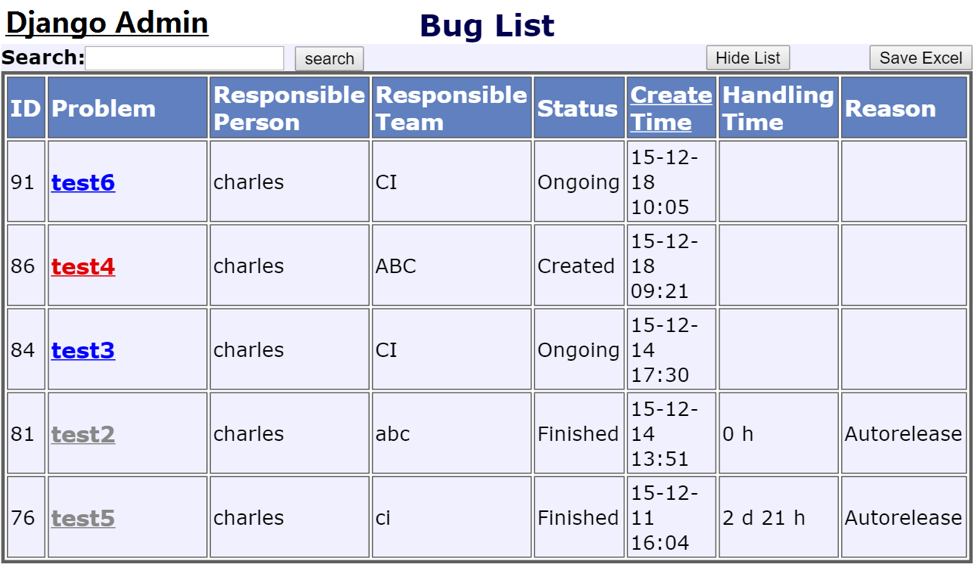
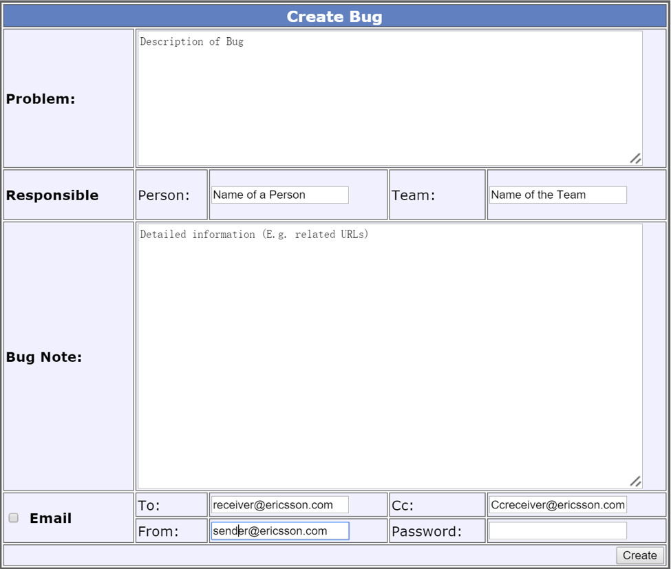
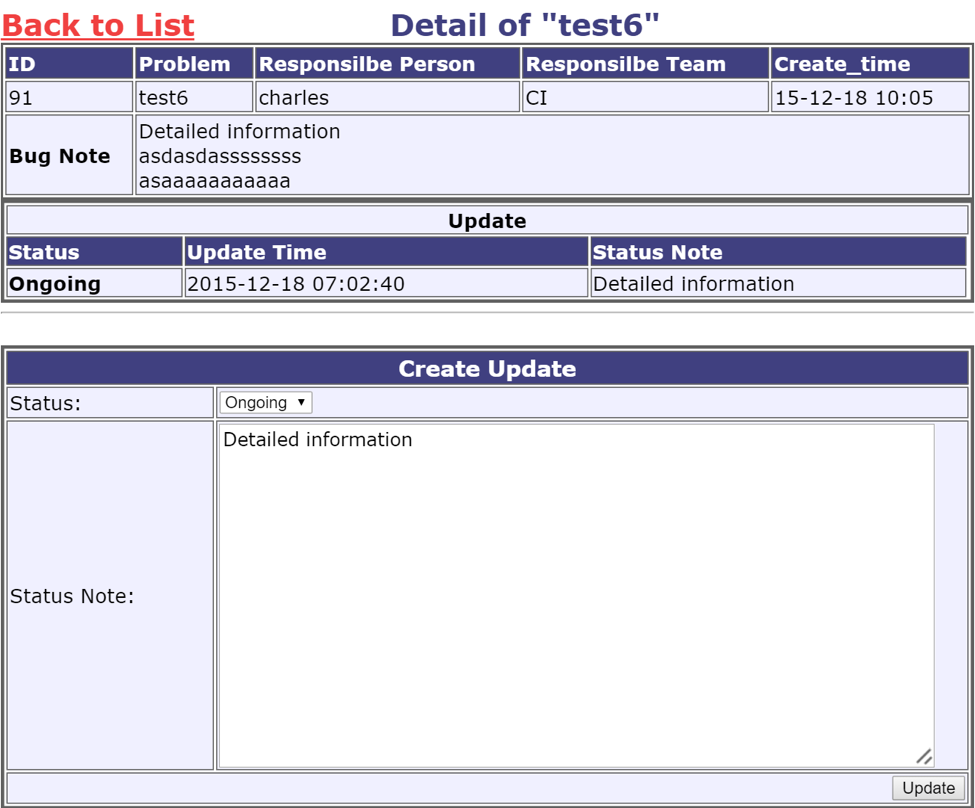
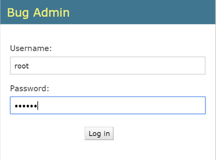
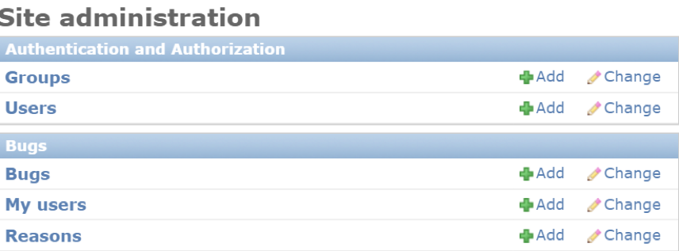

# __Bug Admin__

___
## Author
* __Qi Hu__ Email: qihuchn@gmail.com

___

## Introduction
 * This is a web application for bug (issue) administration
 * The project is implemented with Django and deployed on a Linux server.

## Usage
This project mainly realizes basic functions (Create, Update, Email) of an issue administration system.

1. __Bug List at the Home-Page :__  
All bugs will be shown here. Different colors show the corresponding status:  
 __Red__: Created  
 __Blue__: Ongoing  
 __Gray__: Finished  
Additional functions:  
(a)	To narrow down the range of bugs shown out, input Keywords in “Search” area and click “Search” button. Keywords will be scanned among [problem, responsible person, responsible team, reason];  
(b)	Get a “excel” by clicking “Save Excel” button;  
(c)	Sort the bugs in time sequence by clicking “Create Time” at the top of the list;  
(d)	The “Handling Time” of a bug will be automatically calculated when the bug’s status turns to “Finished”;
(e)	Hide the List by clicking “Hide List” button.  
  

2. __Add a bug & Send an email :__  
Input required information in the “Create Bug” table.  
(a)	The “Email” mark (at left bottom corner) will be selected defaulted to send an email. If you want to add a bug   without sending an email, cancel this mark.  
(b)	There is an authentication for email sender. You need to input the password to send an email. The user name is the same with the “sender” part in “From” Area.  
(c)	Click “Create” button (at right bottom corner) to submit your message, and the alert message will occur at the top of the page.  
  

3. __Update a bug :__  
Input required information in the “Create Update” table.  
(a)	Select the  type of update ( Ongoing or Finished)  
(b)	When “Finished” is chosen, a selection menu for “Reason” will occur , and you can choose from predefined reasons. ”How to edit the reason menu ” will be discuss in Part4-(4)  
(c)	Click “Update” button (at right bottom corner) to submit your Update, and the alert message will occur at the top of the page.  
(d)	Click “Back to List” button (at left top corner) to go back to home page.  
  

4. __Django (Back-end) Admin :__  
The Link of  Django Admin is at the left top corner of Home Page, as shown in Fig.1.  
(a)	As shown in Fig.4 , Login with Username (default: root) and Password (default:123456 )  
(b)	As shown in Fig.5 , the two items above are for admin of the whole framework. You can add users for Django Admin here, or change the password of default user “root”.  
 “Bugs” is the back-end of the database;  
 “My users” is the authentication of sending emails;  
 “Reasons” is content in the reason menu.  
  
  
